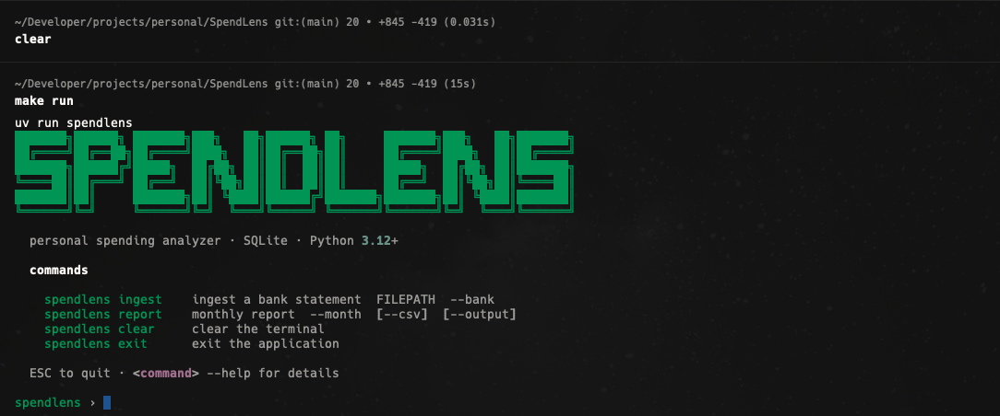
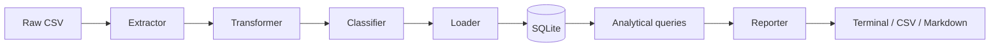

> Personal spending analyzer CLI — statement ingestion, rule-based categorization, and analytical reports.


---

## Stack

| Layer | Technology |
|---|---|
| CLI | [Click](https://click.palletsprojects.com/) + [Rich](https://github.com/Textualize/rich) |
| Persistence | SQLite via `sqlite3` (stdlib) |
| Categorization rules | YAML via `pyyaml` |
| Package manager | [uv](https://docs.astral.sh/uv/) |
| Tests | pytest + pytest-cov |

---

## Architecture

Linear pipeline, no ORM — each stage consumes the previous stage's output:



```
src/spendlens/
├── extractors/      # reads raw CSV per bank schema (Nubank, Itaú) → ExtractionResult
├── transformers/     # normalizes raw schema → canonical schema
├── classifiers/       # assigns a category via keyword rules (data/rules.yaml)
├── loaders/            # creates the SQL schema and inserts transactions (hash dedupe)
├── queries/             # pure analytical SQL, one function per .sql file
├── reporters/            # aggregates queries and exports CSV / Markdown
└── cli/                   # `ingest` and `report` commands, interactive REPL
```

### SQL schema

```sql
CREATE TABLE origins (
    id   INTEGER PRIMARY KEY,
    name TEXT UNIQUE NOT NULL          -- nubank, itau, ...
);

CREATE TABLE categories (
    id   INTEGER PRIMARY KEY,
    name TEXT UNIQUE NOT NULL          -- food, transport, ...
);

CREATE TABLE transactions (
    id          INTEGER PRIMARY KEY,
    date        TEXT    NOT NULL,
    description TEXT    NOT NULL,
    value       REAL    NOT NULL,
    type        TEXT    NOT NULL,      -- income | expense
    origin_id   INTEGER NOT NULL REFERENCES origins(id),
    category_id INTEGER NOT NULL REFERENCES categories(id),
    hash        TEXT    UNIQUE NOT NULL -- dedupe: date+description+value+origin
);
```

---

## Installation

**Prerequisite:** [`uv`](https://docs.astral.sh/uv/getting-started/installation/)

```sh
git clone https://github.com/joaoclaudioprestes/SpendLens.git
cd SpendLens
make setup
```

The SQLite database is created automatically at `data/transactions.db` on first run. Categorization rules live in `data/rules.yaml`.

`--db` (or the `SPENDLENS_DB` environment variable) overrides the default path:

```sh
SPENDLENS_DB=/tmp/test.db spendlens report --month 2025-03
```

---

## Usage

Running `spendlens` with no arguments opens an interactive REPL:

```
$ spendlens
███████╗██████╗ ███████╗███╗   ██╗██████╗ ██╗     ███████╗███╗   ██╗███████╗
██╔════╝██╔══██╗██╔════╝████╗  ██║██╔══██╗██║     ██╔════╝████╗  ██║██╔════╝
███████╗██████╔╝█████╗  ██╔██╗ ██║██║  ██║██║     █████╗  ██╔██╗ ██║███████╗
╚════██║██╔═══╝ ██╔══╝  ██║╚██╗██║██║  ██║██║     ██╔══╝  ██║╚██╗██║╚════██║
███████║██║     ███████╗██║ ╚████║██████╔╝███████╗███████╗██║ ╚████║███████║
╚══════╝╚═╝     ╚══════╝╚═╝  ╚═══╝╚═════╝ ╚══════╝╚══════╝╚═╝  ╚═══╝╚══════╝

  personal spending analyzer · SQLite · Python 3.12+

  commands

    spendlens ingest    ingest a bank statement  FILEPATH  --bank
    spendlens report    monthly report  --month  [--csv]  [--output]
    spendlens clear     clear the terminal
    spendlens exit      exit the application

  ESC to quit · <command> --help for details

spendlens ›
```

`spendlens ingest` without a `FILEPATH` opens a shadcn-style checkbox picker over `data/samples/*.csv` — arrow keys (or j/k) to move, space to toggle, enter to confirm. The bank is inferred from the filename (`nubank`/`itau`).

```
$ spendlens ingest data/samples/nubank_sample.csv --bank nubank
Extracting from NUBANK (nubank_sample.csv)...

Ingest Summary
┏━━━━━━━━━━━━━━━━━━━┳━━━━━━━┓
┃ Metric            ┃ Count ┃
┡━━━━━━━━━━━━━━━━━━━╇━━━━━━━┩
│ Total Rows        │ 60    │
│ Processed         │ 60    │
│ Inserted          │ 60    │
│ Duplicates        │ 0     │
│ Extraction Errors │ 0     │
│ Processing Errors │ 0     │
└───────────────────┴───────┘

Database: data/transactions.db

$ spendlens report --month 2025-03
SpendLens Report — 2025-03
             Total By Category Month
┏━━━━━━━━━┳━━━━━━━━━━━━━━━┳━━━━━━━┳━━━━━━━━━━━━━┓
┃ month   ┃ category      ┃ count ┃ total       ┃
┡━━━━━━━━━╇━━━━━━━━━━━━━━━╇━━━━━━━╇━━━━━━━━━━━━━┩
│ 2025-03 │ housing       │ 6     │ R$ 1,565.19 │
│ 2025-03 │ transport     │ 3     │ R$ 1,387.85 │
│ 2025-03 │ food          │ 3     │ R$ 1,287.54 │
└─────────┴───────────────┴───────┴─────────────┘
  ... + Moving Average 3Months, Top5 Largest Expenses, Month Largest Balance Variation

Report written to: output
```

### Command reference

```
spendlens
  --db PATH               path to the SQLite database          (default: data/transactions.db)

spendlens ingest [FILEPATH]
  --bank [nubank|itau]    bank source                           (required unless inferable, or omit FILEPATH for the picker)

spendlens report
  --month YYYY-MM         report month (default: current month)
  --csv                   also export each query as CSV into --output
  --output PATH           output directory                      (default: ./output)
```

Every command accepts `--help` for details.

---

## Development

```sh
make setup       # uv sync
make test        # pytest
make test-cov    # pytest --cov (HTML report → htmlcov/)
```

`make lint` / `make format` / `make verify` depend on Ruff, not yet configured as a project dependency (pending).

Integration tests run against a real SQLite database (temp file or `:memory:`) — no mocks.

---

## License

[MIT](LICENSE)
